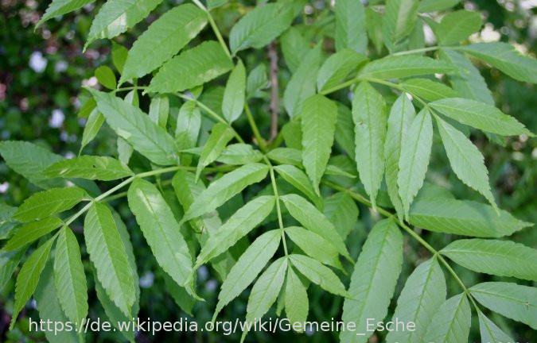

# Umweltecke

In dieser Umweltecke geht es nicht um den Klimaschutz sondern um ein
aktuelles Thema, das Eschensterben. Auch in Bergen sind
viele Eschen betroffen. So wurden z.B. viele Eschen an der 
Achenstauden (im Wald an der Weißache hinter dem Wertstoffhof) gefällt,
da diese Umzustürze drohten. Die Blätter einer gesunden Esche sieht man in der
folgenden Abbildung \[esche-wikipedia\]:

Aber was hat es eigentlich mit dem Eschensterben auf sich? Die Seite
\[ima-agrar\] fasst es wie folgt, sehr gut zusammen:

"_Das Phänomen nennt sich „Neuartiges Eschentriebsterben“. Erreger ist der
Schlauchpilz mit dem Namen „Eschenstengelbecherchen“, genauer die Form
Chalara fraxinea des Pilzes Hymenoscyphus fraxineus. Er stammt aus Japan
und verursacht an der dort heimischen Eschenart keinerlei Symptome. Vor 150
Jahren wurde er mit Eschen nach Estland eingeschleppt, aber erst 1992
wurden im Nordosten Polens Schäden an heimischen Bäumen festgestellt. Die
Vermutung: Der Pilz schädigt europäische Eschen – und zwar stark – weil es
keine Anpassung in der Evolution gab, das mitteleuropäische Klima den Pilz
fördert und weitere Schädlinge die Eschen schwächen. Die Krankheit breitet
sich stetig aus – an Eschen jeden Alters und an allen Standorten in Europa._
    
_Der Pilz bildet an feuchten Tagen ab Anfang Juni weiße Fruchtkörper auf
Eschenblattstielen in der Bodenstreu, wo er überwintert hat. Dieser setzt
unzählige Sporen frei, die mit dem Wind hoch auf die Eschenblätter
gelangen. Dort keimen sie und schädigen das Blattgewebe. Die Bäume stoßen
die befallenen Blätter ab, sodass die Kronen schon im August nahezu kahl
sind. Häufig dringt der Erreger zusätzlich in die Triebe vor, wodurch diese
absterben. Auch die Rinde und das Holz nehmen Schaden und verfärben sich.
Manche Eschen sind vital und fit genug, um die Verluste durch
Ersatztriebbildung auszugleichen, aber auch sie sterben nach wenigen Jahren
vollständig ab. Infizierte Eschen sind anfälliger für z.B. Fäulen am Fuß
des Stammes (Nekrosen) und holzzerstörende Pilze wie Hallimasch und stürzen
um._
    
_Die Epidemie tritt so heftig auf wie kaum bzw. keine Baumkrankheit in
unseren Wäldern vor ihr. Die Ausbreitung des Eschentriebsterbens wird
bundesweit durch die forstlichen Versuchsanstalten beobachtet (Monitoring).
Eine Lösung wird dringend benötigt._"

Soweit die Zusammenfassung von \[ima-agrar\]. Es ist schon spannend, dass
die Japanischen Eschen immun sind / den Evolutionsschritt voraus haben.

Die durch eckige Klammern gekennzeichneten Literaturverweise gibt es wie
immer "anklickbar" unter https://twitter.com/ueckebrgn oder diesem QR-Code.
MB  

----

\[ima-agrar\]: https://www.ima-agrar.de/produkte/lehrermagazin/lmp-ubs/gesellschaft/855-lmp37-ub4, abgerufen 2020-01-17  
\[esche-wikipedia\]: https://de.wikipedia.org/wiki/Gemeine\_Esche,
abgerufen 2020-01-17  

