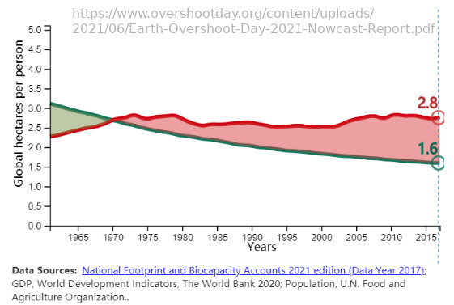

# Umweltecke

in nicht ganz zwei Wochen, am 29. Juli ist der diesjährige Earth Overshoot Day, oder zu deutsch der Erdüberlastungstag \[earthovershootday.org\].

Was bedeutet eigentlich Erdüberlastungstag? Laut \[wikipedia\]: "*Das jeweilige Datum wird berechnet, indem der globale ökologische Fußabdruck (die menschliche Nachfrage an biologischen Ressourcen innerhalb des betreffenden Jahres) in ein Verhältnis zur gesamten globalen Biokapazität (die Menge der weltweiten Regeneration von biologischen Ressourcen innerhalb desselben Jahres) gesetzt wird; analog wird die jeweilige jährliche Ressourceninanspruchnahme auf eine entsprechende Anzahl Erden hochgerechnet*".

Oder anders ausgedrückt: Das berechnete Datum besagt an welchem Tag die Menschheit die Ressourcen, die die Erde in einem Jahr biologisch produzieren kann, vollständig aufgebraucht hat. Alles was über diesem Datum verbraucht wird, geht zulasten der nächsten Generation. Der 29. Juli entspricht hochgerechnet auf ein Jahr einem Verbrauch der Menschheit von gemittelt 1.7 Erden. Wir verbrauchen also 1.7 Erden, wo wir nur eine haben. 

Dieses Verhältnis ändert sich von Jahr zu Jahr, was in der folgenden Grafik zu sehen ist \[earthovershootday/report\]. Die grüne Kurve zeigt die Biokapazität in Hektar pro Person, die jährlich neu gebildet wird. In rot ist der durchschnittliche Hektar Verbrauch pro Mensch dargestellt. Teilt man den Wert der roten Kurve durch den Wert der grünen Kurve, so erhält man den Verbrauch an Erden (2.8 / 1.6 ~= 1.7). Auffällig ist, dass sich die Kurve seit Beginn der Erfassung 1960 stetig verschlechtert. 1970 war die Anzahl der verbrauchten Erden bei 1.0, d.h. ein sich gegenseitig kompensierender Zustand. Auffallend ist, dass der Verbrauch (rot) relativ gleichbleibend ist. Jedoch sinkt die regenerative Biokapazität der Erde (grün) stetig.  
.

Der Verbrauch in "Erd-Einheiten" unterscheidet sich zwischen den Ländern. In der folgenden Tabelle sind die Top 6 Verbraucher von 2021 zu sehen \[earthovershootday/how-many-earths\].

| Land | Verbrauchte Erden |
| ---- | ----------------- |
| U.S.A. | 5 |
| Australien | 4.6 |
| Russland | 3.4 |
| Frankreich | 2.9 |
| Deutschland | 2.9 |
| Japan | 2.9 |
| Globale Durchschnitt | 1.7 |

Dabei fällt auf, dass Deutschland an Stelle 5 mit 2.9 weit über den weltweiten Durchschnitt von 1.7 liegt. Der Erdüberlastungstag runtergerechnet auf Deutschland war übrigens bereits am 5. Mai \[earthovershootday/newsroom\].

Das heißt gerade wir Deutschen haben in puncto Ressourcenverbrauch einiges an Optimierungsbedarf.

Die durch eckige Klammern gekennzeichneten Literaturverweise gibt es 
unter https://github.com/mbbrgn/umweltecke/blob/master/015_earth_overshoot_day/text.md
 
MB  

----

- \[wikipedia\]: https://de.wikipedia.org/wiki/Earth_Overshoot_Day
- \[earthovershootday.org\]: https://www.overshootday.org/
- \[earthovershootday/report\]: https://www.overshootday.org/content/uploads/2021/06/Earth-Overshoot-Day-2021-Nowcast-Report.pdf
- \[earthovershootday/how-many-earths\]: https://www.overshootday.org/how-many-earths-or-countries-do-we-need/
- \[earthovershootday/newsroom\]: https://www.overshootday.org/newsroom/press-release-germany-overshoot-day-2021-de/

